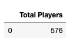
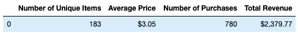
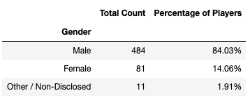
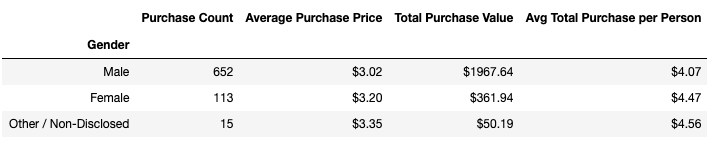
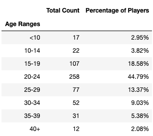
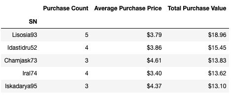
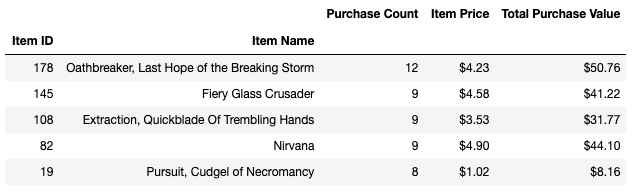
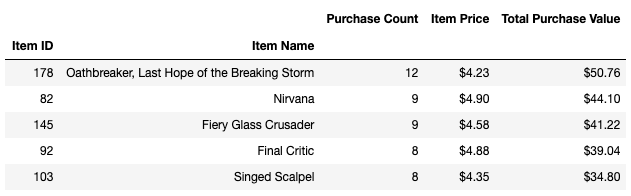

# Heroes of Pymoli

After a lot of hard work in the data munging mines, you've landed a job as Lead Analyst for an independent gaming company. You've been assigned the task of analyzing the data for their most recent fantasy game Heroes of Pymoli.
Like many others in its genre, the game is free-to-play, but players are encouraged to purchase optional items that enhance their playing experience. As a first task, the company would like you to generate a report that breaks down the game's purchasing data into meaningful insights. We have been given a csv file containing purchasing data located in the Resources folder. 

## Player Count
- Total Number of Players

## Purchasing Analysis (Total)
- Number of Unique Items
- Average Purchase Price
- Total Number of Purchases
- Total Revenue

## Gender Demographics
- Percentage and Count of Male Players
- Percentage and Count of Female Players
- Percentage and Count of Other / Non-Disclosed

## Purchasing Analysis (Gender)
The below each broken by gender:
- Purchase Count
- Average Purchase Price
- Total Purchase Value
- Average Purchase Total per Person by Gender

## Age Demographics
The below each broken into bins of 4 years (i.e. <10, 10-14, 15-19, etc.):
- Purchase Count
- Average Purchase Price
- Total Purchase Value
- Average Purchase Total per Person by Age Group

## Top Spenders
Identify the the top 5 spenders in the game by total purchase value, then list (in a table):
 -SN
- Purchase Count
- Average Purchase Price
- Total Purchase Value

## Most Popular Items
Identify the 5 most popular items by purchase count, then list (in a table):
- Item ID
- Item Name
- Purchase Count
- Item Price
- Total Purchase Value

## Most Profitable Items
Identify the 5 most profitable items by total purchase value, then list (in a table):
- Item ID
- Item Name
- Purchase Count
- Item Price
- Total Purchase Value

## Conclusions
1) Most of the total revenue was generated by males and people in age group 20-24. Males spent the least amount per purchase but still generated the greatest total volume due to the sheer amount purhcase.
2) Percentage breakdown of total revenue by gender is closely proportional to the percentage amount of purchases by each gender and count of gender (i.e. male total revenue $1967.64/ total revenue $2,379.77 = 82.7% ~ percent of male players 84.0% ~ male purchase count 652/ total purchase count 780 = 80.1% )
3) The most popular items generate the the most revenue and are actually above the average price  ($3.06) for a game item. Kind of intuitive if prices are similar for the items but if the most popular items were priced very low then they might not generate the highest revenues. This shows they are priced well and can maybe even be increased on price because people are buying a lot of the items at the current high prices.
